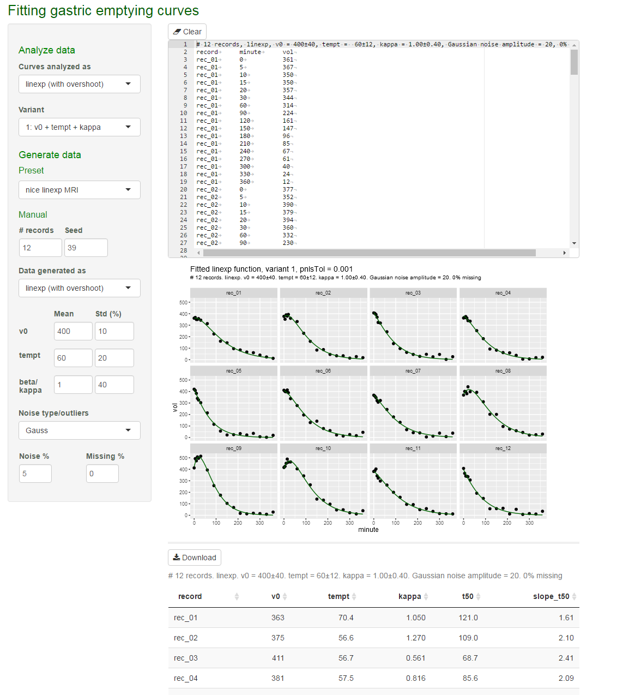

[](https://travis-ci.org/dmenne/gastempt)
[](https://coveralls.io/github/dmenne/gastempt?branch=master)

# Fitting gastric emptying curves

By dieter.menne@menne-biomed.de, Menne Biomed Consulting Tübingen, D-72074 Tübingen

A package and a Shiny web application to create simulated gastric emptying data, and to analyze experimental gastric emptying data using population fit with R and package nlme. Simplified versions of Stan-based (http://mc-stan.org/) Bayesian fits are included and will be extended in future.

Part of the work has been supported by section GI MRT, Klinik für Gastroenterologie und Hepatologie, Universitätsspital Zürich; thanks to Werner Schwizer and Andreas Steingötter for support.


The package is available from github: https://github.com/dmenne/gastempt. It can be installed with

```
devtools::install_github("dmenne/gastempt")
```

Compilation of the Stan models require several minutes.

## Shiny online interface

The web interface can be installed on your computer, or [run in ShinyApps](  
https://menne-biomed.shinyapps.io/gastempt/).

Two models are implemented in the web interface

* `linexp, vol = v0 * (1 + kappa * t / tempt) * exp(-t / tempt):`Recommended for gastric emptying curves with an initial volume overshoot from secretion. With parameter kappa > 1, there is a maximum after t=0.  When all emptying curves start with a steep drop, this model can be difficult to fit.
* `powexp, vol = v0 * exp(-(t / tempt) ^ beta):` The power exponential function introduced by Elashof et. al. to fit scintigraphic emptying data; this type of data does not have an initial overshoot by design. Compared to the `linexp` model, fitting `powexp` is more reliable and rarely fails to converge in the presence of noise and outliers. The power exponential can be useful with MRI data when there is an unusual late phase in emptying.

* Data can be entered directly from the clipboard copied from Excel, or can be simulated using a Shiny app.
* Several preset simulations are provided in the Shiny app. 
* Robustness of models can be tested by manipulating noise quality and between-subject variance. 
* Fits are displayed with data.
* The coefficients of the analysis including t50 and the slope in t50 can be downloaded in .csv format.

## In source code, not yet in web interface 

* [Stan-based fits](http://menne-biomed.de/blog/tag:Stan). See the documentation of R function [stan_gastempt](https://github.com/dmenne/gastempt/blob/master/R/stan_gastempt.R) in the package. Some details can be found in [my blog](http://menne-biomed.de/blog/multiple-indexes-stan). The rationale for using Stan to fit non-linear curves is discussed here for [<sup>13</sup>C breath test data](http://menne-biomed.de/blog/breath-test-stan) and equally valid for gastric emptying data. 

Example program with simulated data (needs about 40 seconds till plot shows):

```
library(gastempt)
dd = simulate_gastempt(n_records = 6, seed = 471)
d = dd$data
ret = stan_gastempt(d)
print(ret$coef)
print(ret$plot)
```

## Coming:

* Web interface for Shiny fits
* Post-hoc analysis in Shiny application by treatment groups, both for cross-over and fully randomized designs.




